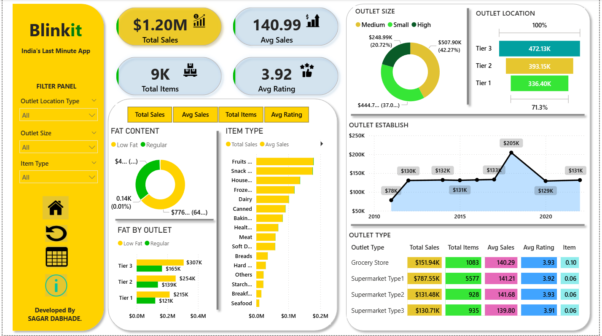
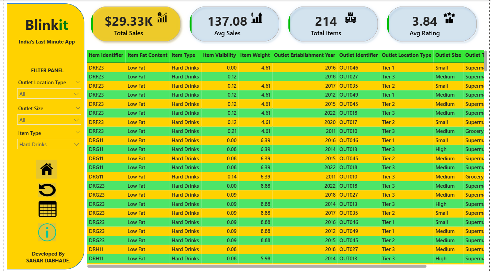

# 📊 Blinkit Sales Dashboard  

A Power BI project by **Sagar Dabhade** to analyze **Blinkit sales data** and get useful business insights.  

---

## 📂 Project Files  
- `Dashboard/blinkit-Dashboard.png` → Main Sales Dashboard  
- `Dashboard/blinkit-table_info.png` → Item-wise Table Dashboard  

---

## 🚀 What This Dashboard Shows  
✅ Total Sales, Average Sales, and Ratings  
✅ Item Type and Fat Content Analysis  
✅ Outlet Size and Location Performance  
✅ Year-wise Outlet Establishment Trend  
✅ Grocery Store vs Supermarket Type Comparison  

---

## 🖼️ Dashboard Screenshots  

### 1️⃣ Main Sales Dashboard  
- KPIs: Total Sales ($1.20M), Total Items (9K), Average Sales, Average Rating  
- Fat Content (Low Fat vs Regular)  
- Item-wise Sales  
- Outlet Size & Location  
- Establishment Trend by Year  
- Outlet Type Comparison  

  

---

### 2️⃣ Item-level Table Dashboard  
- KPIs: Total Sales, Avg Sales, Total Items, Avg Rating  
- Item details: Fat Content, Visibility, Weight, Establishment Year  
- Outlet Location, Size, and Type  

  

---

## 📌 Key Insights  
🔹 Total Sales = **$1.20M**, Avg Rating = **3.92**  
🔹 **Tier 3 outlets** have the highest sales ($472K)  
🔹 **Regular Fat items** sell more than Low Fat  
🔹 **Supermarket Type 1** is the top outlet (~$787K sales)  
🔹 Sales peaked in **2018 ($205K)** before stabilizing  

---

## 🛠️ Tools Used  
- **Power BI** → For creating dashboards  
- **Excel / CSV** → Data source  
- **GitHub** → Project hosting  

---

## 👤 Author  
**Sagar Dabhade**  
_Data Analyst | Power BI Enthusiast_  
